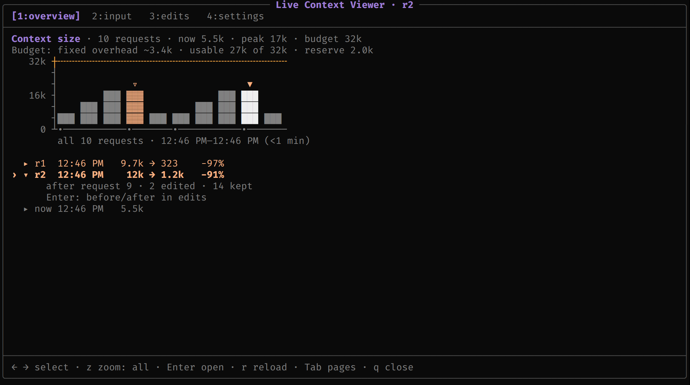
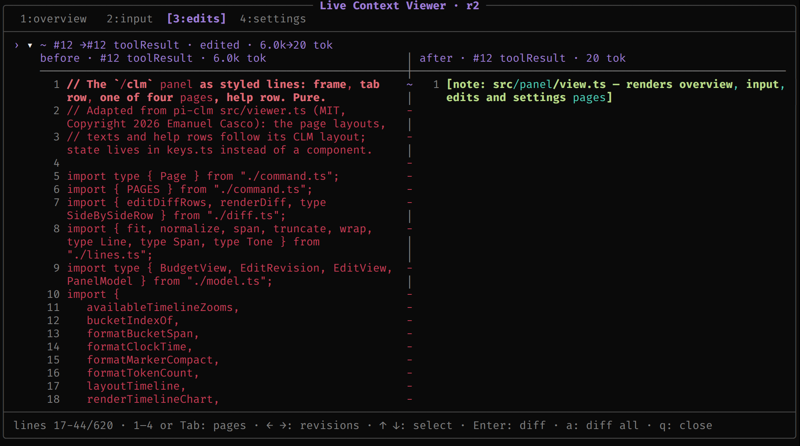
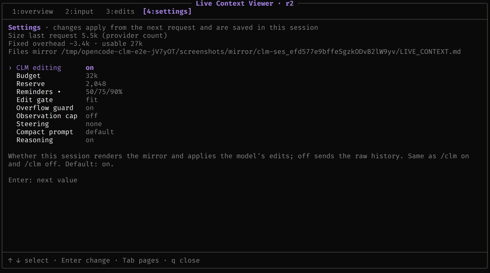

# opencode-clm

```
  ____ _     __  __
 / ___| |   |  \/  |
| |   | |   | |\/| |
| |___| |___| |  | |
 \____|_____|_|  |_|     opencode-clm: the model manages its own context in OpenCode
```

`opencode-clm` is an [OpenCode](https://opencode.ai) plugin that runs a model as a Context
Language Model. Before each request the plugin writes the conversation to a text file; the
model edits that file with its ordinary tools, and the edited text is what it receives on
the next request. OpenCode's stored session stays unchanged. It ports
[pi-clm](https://github.com/lolipopshock/pi-clm) 1.0.0, the Pi extension that accompanies
the paper [Context Language Models](https://arxiv.org/abs/2609.37725).
[PORTING.md](PORTING.md) maps each pi-clm file to its counterpart here.

## Install

Tested with OpenCode 1.18.34. The package holds two plugins, and OpenCode loads them from
two lists:

- the **server plugin** (`index.ts`) in `plugin` of `opencode.json`: the mirror, edits,
  budget, tools, and the `/clm` and `/clm-compact` commands;
- the **TUI plugin** (`tui.ts`) in `plugin` of `tui.json`: the `/clm` panel.

```sh
opencode plugin opencode-clm        # project: adds it to .opencode/opencode.json and .opencode/tui.json
opencode plugin -g opencode-clm     # global: opencode.json(c) and tui.json in ~/.config/opencode
```

`opencode plugin` detects both targets from the package and writes the spec to both
files. To do it by hand, add `"opencode-clm"` to both lists:

```jsonc
// opencode.json
{ "plugin": [["opencode-clm", { "budget": "64k" }]] }
// tui.json
{ "plugin": ["opencode-clm"] }
```

Options go on the `opencode.json` entry only; the TUI plugin finds that entry and reads
the same options (`mirrorDir` above all). It recognises `opencode-clm`,
`opencode-clm@<version or source>` (including the `opencode-clm@file:…` form `opencode
plugin` writes for a tarball), and `file://` URLs or paths that name this package or its
`index.ts`. From a local clone, use `file:///path/to/opencode-clm/index.ts` in
`opencode.json` and `file:///path/to/opencode-clm/tui.ts` in `tui.json`.

With the TUI plugin, a typed `/clm …` line runs in the TUI and costs no model turn: the
panel opens, or a toast answers, or the setting changes. Only `/clm reset` goes to the
server command. Without the TUI plugin (or with `opencode run --command clm`), the server
command answers `/clm` as text, which costs one model turn because OpenCode cannot cancel
a command. Version 0.1.0 on npm has the server plugin only; the panel and `/clm config`
arrive with 0.2.0.

## Quick start

| command | what it does |
|---------|--------------|
| `/clm` | open the panel: **overview** (context size per request, fixed overhead and usable budget, every accepted edit) <br> <br> **input** (what the next request will contain) · **edits** (each revision, message by message, with a side-by-side diff) <br> |
| `/clm status` | a toast: CLM on or off, revision, last request size, budget, fixed overhead, last outcome (the server command's text adds the changed settings) |
| `/clm config` | open **settings**; `/clm config <setting> <value>` changes one, `/clm config reset` drops this session's changes <br> |
| `/clm-compact [instructions]` | ask the model to compact its context now; text you add (what to keep, for example) goes into the prompt. The result shows on the **edits** page |
| `/clm on` / `off` / `reset` | apply edits or send the raw history for this session (the `editing` setting); `reset` drops the accepted revision (server command, one model turn) |

In the panel: `1–4` or `Tab` switch pages, `← →` step through the overview's list
(edits, rejections, resets, compactions, now) or the edits page's revisions, `z` zooms
the chart, `Enter` opens the selection, `r` reloads, `q` closes.

## Docs

- [How it works](docs/how-it-works.md): the mirror, edits, the budget, compaction, the panel, safety.
- [Configuration](docs/configuration.md): sizing the budget, every setting and its environment variable, `/clm config`.
- [Architecture](docs/architecture.md): modules, session files, design notes, known limitations.
- [Development](docs/development.md): setup, checks, the integration suites, releasing.

## Citation

If you use opencode-clm in your research, please cite
[Context Language Models](https://arxiv.org/abs/2609.37725):

```bibtex
@article{shao2026context,
  title   = {Context Language Models},
  author  = {Shao, Rulin and Shen, Shannon Zejiang and Yin, Junjie Oscar and Li, Yuetai and
             Wang, Minheng and Ivison, Hamish and Poovendran, Radha and Lambert, Nathan and
             Xiao, Teng and Lewis, Mike and Yih, Wen-tau and Zettlemoyer, Luke and Koh, Pang Wei},
  journal = {arXiv preprint arXiv:2609.37725},
  year    = {2026}
}
```

## Credits

- [pi-clm](https://github.com/lolipopshock/pi-clm) 1.0.0 (MIT, Copyright 2026 Emanuel
  Casco): the design and most of the code derive from it, the `/clm` panel included
  (`src/panel/timeline.ts`, `src/panel/diff.ts` and the page layouts in
  `src/panel/view.ts` port its `timeline.ts`, `diff.ts` and `viewer.ts`). Model-facing text
  taken from pi-clm, adapted: the compaction prompt (`src/compact.ts`), the `clm-context`
  skill, the budget notices, the mirror rejection and receipt messages, and the overflow
  and observation notes. `steering/house-brief.md` is byte-identical to pi-clm's. Written
  for this package: the system-prompt protocol section (`src/presentation.ts`), the
  edit-gate refusal note, and the plugin's own receipts, commands and tool descriptions.
  [NOTICE](NOTICE) lists the files; [LICENSE](LICENSE) carries pi-clm's notice.
- Context Language Models, [arXiv 2609.37725](https://arxiv.org/abs/2609.37725), and
  [facebookresearch/context-language-models](https://github.com/facebookresearch/context-language-models)
  (CC BY-NC 4.0). This package copies no text from that repository (normalized 5-gram
  check: no shared span over 6 tokens). The `fit` / `shrink` edit gate and the default
  25/50/75% reminder steps follow its harness design, and the edit-cost advice in the
  skill, inherited from pi-clm, covers the same points as the harness prompt in different
  words. This package is not licensed under CC BY-NC and is not endorsed by its authors.

## AI assistance

Claude Code (Claude Opus) wrote the code and documentation in this repository. The
maintainer has not hand-reviewed them.

## License

MIT. See [LICENSE](LICENSE), which includes the pi-clm notice, and [NOTICE](NOTICE).
